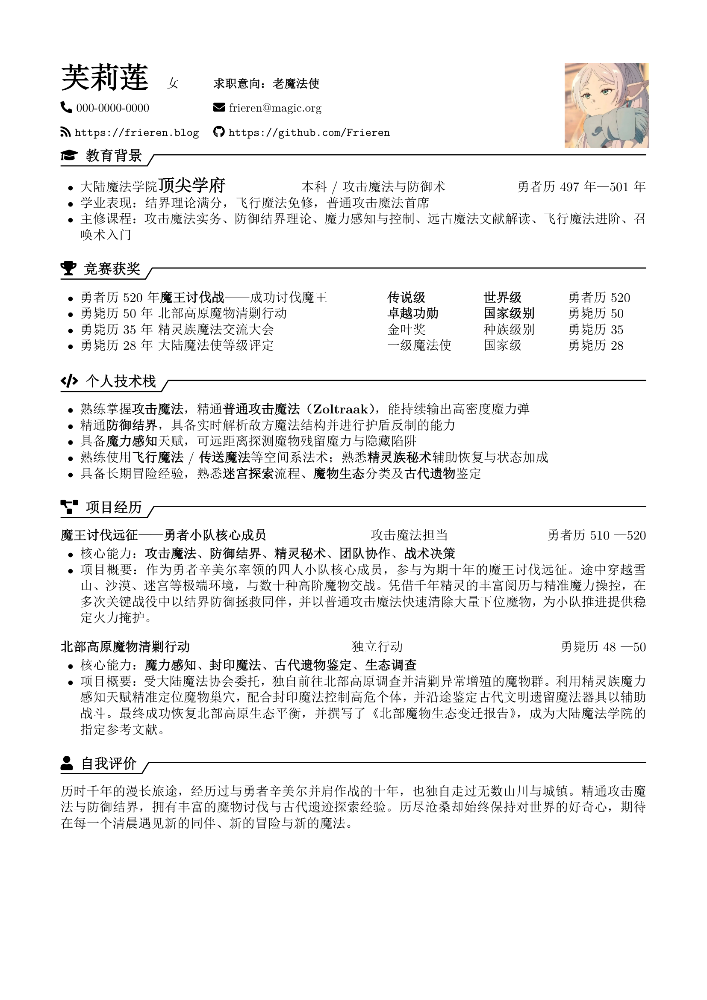
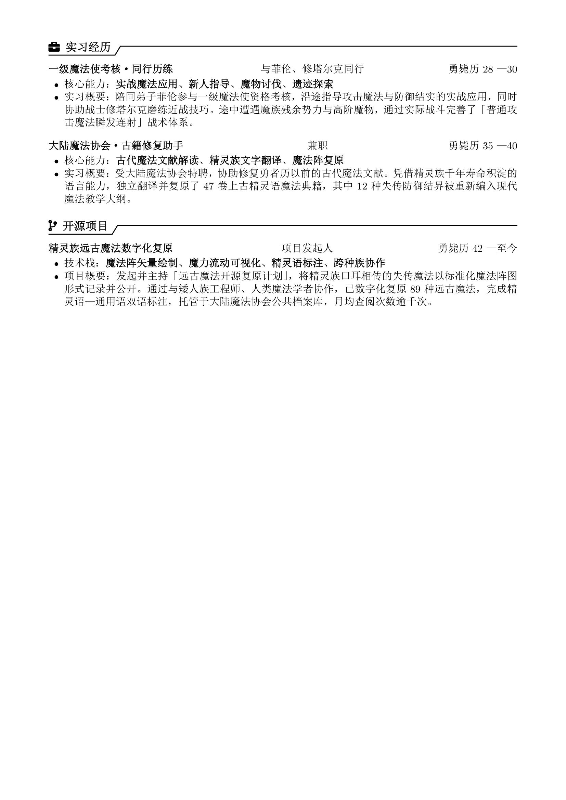

# 芙莉莲简历模板

简约优雅的中文简历 LaTeX 模板，以《葬送的芙莉莲》为主题。`\boldtext{}` 命令一键加粗关键词，适合快速填充内容。

---

## 📄 效果预览

### 第 1 页



### 第 2 页



---

## 🛠️ 快速开始

```bash
# 编译
xelatex 简历.tex

# 清理辅助文件
rm 简历.aux 简历.log 简历.out
```

---

## ✏️ 自定义

1. 修改 `简历.tex` 中的个人信息、教育、经历等文字
2. 替换 `frieren.png` 为你的一寸照片（2.5cm × 3.5cm）
3. 按需调整页边距：`\usepackage[top=1.5cm, bottom=1cm, left=1.8cm, right=1.8cm]{geometry}`

---

## 📐 样式说明

| 项目 | 配置 |
|------|------|
| 正文字体 | SimSun（宋体）+ AutoFakeBold 加粗 |
| 标题 | 黑灰 + 折角下划线 |
| 图标 | 黑色 Font Awesome 5 |
| 字号 | 正文 11pt，章节标题 `\large` |
| 列表 | `\boldtext{}` 关键字加粗 |

---

## 🏷️ 板块

个人信息 · 教育背景 · 竞赛获奖 · 个人技术栈 · 项目经历 · 自我评价 · 实习经历 · 开源项目

---

## ⚠️ 注意

- 宋体无原生粗体，使用 `AutoFakeBold=2.5` 伪粗体
- 无页码（`\pagestyle{empty}`）
- 使用 XeLaTeX 编译

---

## 📝 License

MIT
